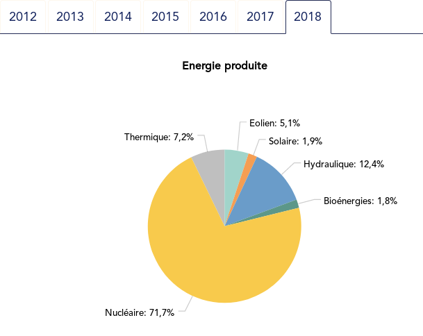
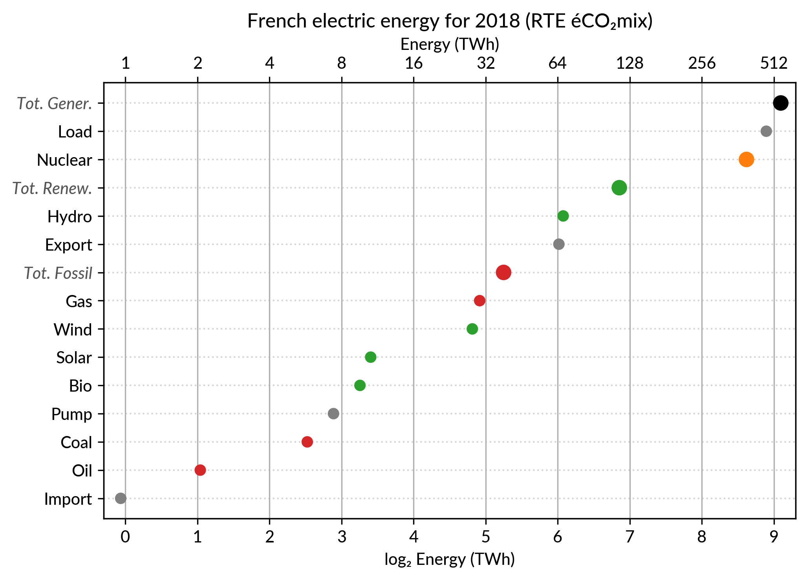
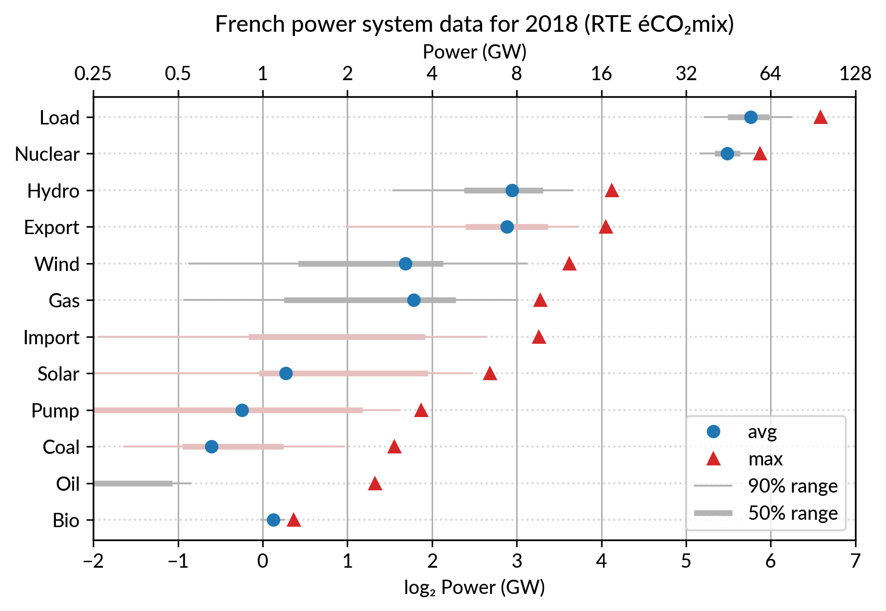
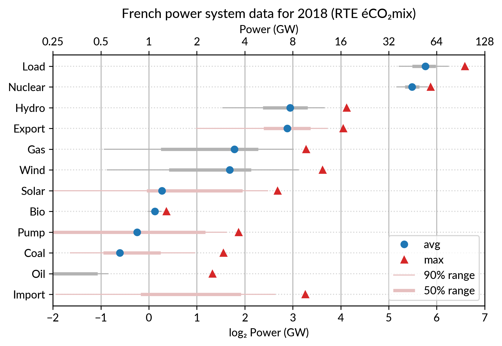
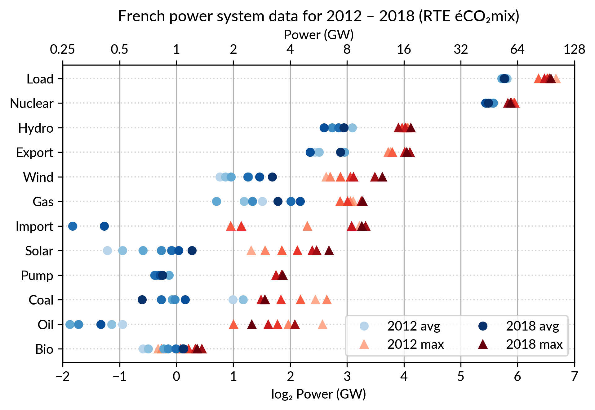
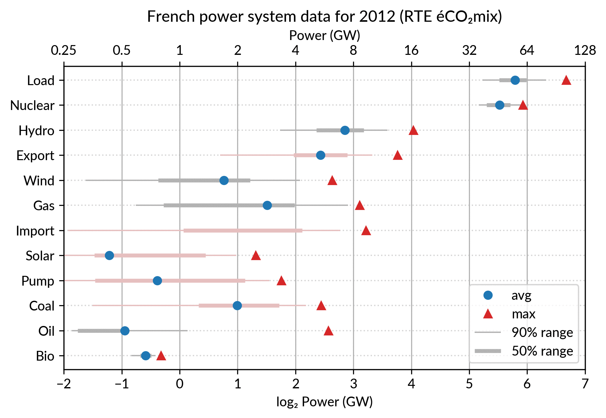

# Pie vs Dots: exploring Cleveland dot plot to show power system data

These last weeks, I’ve read [William S. Cleveland](https://en.wikipedia.org/wiki/William_S._Cleveland) book “[The Elements of Graphing Data](https://www.goodreads.com/book/show/18619.Elements_of_Graphing_Data)”.
I had heard it’s a classical essay on data visualization.
Of course, on some aspects, the book shows its age (first published in 1985), for example
in the seemingly exceptional use of color on graphs.
Still, most ideas are still relevant and I enjoyed the reading.
Some proposed tools have become rather common, like [loess curves](https://en.wikipedia.org/wiki/Local_regression).
Others, like the many charts he proposes to compare data distributions (beyond the common histogram),
are not so widespread but nevertheless interesting.

One of the proposed tools I wanted to try is the *(Cleveland) dot plot*.
It is advertised as a replacement of pie charts and (stacked) bar charts, but with a *greater visualization power*.
Cleveland conducted scientific experiments to assess that superiority, but it’s not detailed in the book (perhaps it is in the [Cleveland & McGill 1984 paper](https://www.jstor.org/stable/2288400)).

I’ve explored the visualization power of dot plots using the French electricity data from [RTE éCO₂mix](https://www.rte-france.com/fr/eco2mix/eco2mix) (RTE is the operator of the French transmission grid).
I’ve aggregated the hourly data to get yearly statistics similar to RTE’s yearly [statistical report on electricity](https://bilan-electrique-2018.rte-france.com/) (« Bilan Électrique »).


## The case for dot plot

Such yearly energy data is typically represented with pie charts to show the *share* of each category of power plants. This is RTE’s pie chart for 2018 (from the [Production](https://bilan-electrique-2018.rte-france.com/production-totale/#) chapter):



However, Cleveland claims that the dot plot alternative enables **more efficient reading** of single point values
and also **easier comparison** of different points together. Here is the same data shown with a *simple dot plot*:



I’ve colored plant types by three general categories:

* Fossil (gas, oil and coal) in red
* Renewable (hydro, wind, solar and bioenergy) in green
* Nuclear in orange

Subtotals for each category are included.
Gray points are either not a production (load, exports, pumped hydro) or cannot be categorized (imports).

Compared to the pie chart, we benefit from the ability to read the *absolute values* rather than just the shares.
However, how to read those shares?

This is where the *log₂ scale*, also promoted by Cleveland in his book, comes into play. It serves two goals. First, like any log scale, it avoids the *unreadable clustering of points around zero* when plotting values with different orders of magnitude.
However, Cleveland specifically advocates log₂ rather than the more common log₁₀ when the difference in orders of magnitude is small (here less than 3, with 1 to 500 TWh) because it would yield a too small number of tick marks (1, 10, 100, 1000 here) and also because *log₂ aids reading ratios* of two values:

* a distance of 1 in log₂ scale is a 50% ratio
* a distance of 2 in log₂ scale is a 25% ratio
* …

Still, I guess I’m not the only one unfamiliar with this scale, so I made myself a small conversion table:

| Δlog | ratio a/b (%)     | ratio b/a |
|------|-------------------|-----------|
| 0.5  | 71% (~2/3 to 3/4) | 1.4       |
| 1    | 50% (1/2)         | 2         |
| 1.5  | 35% (~1/3)        | 2.8       |
| 2    | 25% (1/4)         | 4         |
| 3    | 12%               | 8         |
| 4    |  6%               | 16        |
| 5    |  3%               | 32        |
| 6    |  1.5%             | 64        |

As an example, Wind power (~28 TWh) is at distance 2 in log scale of the Renewable Total, so it is about 25%. Hydro is distant by less than 1, so ~60%, while Solar and Bioenergies are at about 3.5 so ~8% each.

Of course, the log scale *blurs the precise value* of large shares. In particular, Nuclear (distant by 0.5 to the total generation) can be read to be somewhere between 65% and 80% of the total, while the exact share is 71.2%. The pie chart *may seem more precise* since the Nuclear part is clearly slightly less than 3/4 of the disc.
However, Cleveland warns us that the angles 90°, 180° and 270° are special easy-to-read anchor values whereas most other values are in fact difficult to read.
For example, how would I estimate the share of Solar in the pie chart without the “1.9%” annotation? On the log₂ scaled dot plot, only a little bit of grid line counting is necessary to estimate the distance between Solar and Total Generation to be ~5.5, so indeed about 2% (with the help of the conversion table…).


## The bar chart alternative?

Along with the pie chart, the other classical competitor to dot plots is the bar chart.
It’s actually a stronger competitor since it avoids the pitfall of the poorly readable angles of the pie chart.
I (with much help from Cleveland) see three arguments for favoring dots over bars.

The weakest one may be that dots create *less visual clutter*. However, I see a counter-argument that bars are *more familiar* to most viewers, so if it were only for this, I may still prefer using bars.

The second argument is that the *length of the bars would be meaningless*. This argument only applies when there is no absolute meaning for the common “root” of the bars. This is the case here with the log scale. It would also be the case with a linear scale if, for some reason, the zero is not included.

The third argument is an extension of the first one (better clarity) in the case when *several data points* for each category must be compared. Using bars there are two options:
* drawing bars *side by side*: yields poor readability
* *stacking* bars on top of each other (if the addition makes sense like votes in an election): makes a loss of the common ground, except for the bottom most bars (of left most bars when using the horizontal layout like here)

This brings me to the case where dot plots shine most: *multiway* dot plots.


## Multiway dot plots

The compactness of the “dot” plotting symbol (regardless of the actual shape: disc, square, triangle…) compared to bars allows superposing several data points for each category.

Cleveland presents multiway dot plots mostly by stacking horizontally several simple dot plots. However, now that digital media allows high quality colorful graphics, I think that superposition on a single plot is better in many cases.

For the electricity data, I plot for each plant category:
* the *maximum* power over the year (GW): red triangles
* the *average* power over the year (GW): blue discs

The maximum power is interesting as a proxy to the power capacity.
The average power is simply the previously shown yearly energy production data, divided by the duration of the year.
The benefit of using the average power is that it can be superimposed
on the plot with the power capacity since it has the same unit.
Also, the ratio of the two is the *capacity factor* of the plant category, which is a third interesting information.

Since it is recommended to *sort the categories by value* (to ease comparisons), there are two possible plots:

* plot sorted by the maximum powers (~capacity)
* plot sorted by the average powers (equivalent to the cumulated energy for the year)

The two types of sorts are slightly different (e.g. switch of Wind and Gas) and I don’t know if one is preferable.





### Adding some quantiles

Since I felt the superposition of the max and average data was leaving enough space, I packed 4 more numbers by adding gray lines showing the 90% and 50% range of the power distribution over the year.
With these lines, the chart starts looking like a [box plot](https://en.wikipedia.org/wiki/Box_plot), albeit pretty non-standard.

However, I faced one issue with the quantiles: some plant categories are shut down (i.e. power ≤ 0) for a significant fraction of the year:
* Solar: 52% (that is at night)
* Coal: 29% in 2018
* Import: 96% (meaning that the French grid was net-importing electricity from its neighbors only 4% of the year in 2018)

To avoid having several quantiles clustered at zero, I chose to compute them only for the running hours (when >0). To warn the viewer, I drew those peculiar quantiles in light red rather than gray.
Spending a bit more time, it would be possible to stack on the right a second dot plot showing just the shutdown times to make this more understandable.


## Animated dot plots

Again trying to pack more data on the same chart, I superimposed the statistics for several years.
RTE’s data is available from 2012 to 2018 (2019 is still in the making…) and the year can be encoded by the *lightness* of the dots.



I think it is possible to perceive interesting information from this chart (like the rise of Solar and Wind along the drop of Coal), but it may be a bit too *crowded*.
With only two or three years (e.g. [2012-2015- 2018](https://raw.githubusercontent.com/pierre-haessig/french-elec2/master/dotplots/Dotplot_Powersys_2012-15-18.png)), it is fine though.

A better alternative may be to **use an animation**. I tried two solutions:
* GIF animation generated from the sequence of plots for each year
* Interactive plot with the highlight of each year with mouse interaction using [Altair](https://altair-viz.github.io/)

### GIF animation

To assemble a set of PNG images (`Dotplot_2012.png` to `Dotplot_2018.png`) into a GIF animation,
I used the following “incantation” of ImageMagick:

```
convert -delay 30 -loop 0 Dotplot_*.png Dotplot_anim.gif
```

The `-delay 30` option sets a frame duration of 30/100 seconds, so about 3 images/s.



The result is nice but it is not possible to pause on a given year for a closer inspection.
Using a video file format instead of GIF, pausing would be possible, but a convenient way
to browse through the years would be much better.

### Interactive dot plots with Altair/Vega

For a true interactive plot, I’ve played with [Altair](https://altair-viz.github.io/), the Python package based on the [Vega/Vega-Lite](https://vega.github.io/) JavaScript libraries.
It’s the second or third time I experiment with this library
(all the other plots are made with [Matplotlib](https://matplotlib.org)).
I find Altair appealing for its *declarative* programming interface
and the fact it is based on a sound *visualization grammar*. For example, it is based on a well-defined notion of [visual encoding channels](https://altair-viz.github.io/user_guide/encoding.html): position, color, shape…

For the present task, I wanted to explore more particularly the *declarative description of interactivity*, a feature added in late 2017/early 2018 with the release of [Vega-Lite 2.0](https://medium.com/@uwdata/introducing-vega-lite-2-0-de6661c12d58)/[Altair 2.0](https://twitter.com/jakevdp/status/974761969549852672).

Here is the result, illustrated by a screencast video before I get to know
how to embed a Vega-Lite chart in Wordpress:


To experience the interactivity, here is a standalone HTML page with the plot:
[Dotplot_Powersys_interactive.html](https://pierreh.eu/wp-content/uploads/Dotplot_Powersys_interactive.html)

### A quick overview of interactivity with Altair

Specifying such a user interaction with a chart starts with the description of a [selection](https://altair-viz.github.io/user_guide/interactions.html) object like this:

```
selector = alt.selection_single(
    fields=['year'],
    empty='none',
    on='mouseover',
    nearest=True,
    init=alt.SelectionInitMapping(year=2018)
)
```

Here `fields=['year']` means that hovering one point will automatically select
*all the data samples having the same year*.

Then, the selection object is to be appended to one or several charts
(so that the selection works seamlessly across charts).
This is no more than calling `.add_selection(selector)` on each chart.

Finally, the selection is used to conditionally set the color of plotting marks,
or whatever visual encoding channel we may want to modify (size, opacity…).
A [condition](https://altair-viz.github.io/user_guide/interactions.html#conditions-making-the-chart-respond)
takes a reference to the selection and two values: one for the selected case, the second when unselected.
Here is, for example, the complete specification of the bottom chart which
serves as a year selector:

```
years = base.mark_point(filled=True, size=100).encode(
    x='year:O',
    color=alt.condition(selector,
                        alt.value('green'),
                        alt.value('lightgray')),
).add_selection(selector)
```

The Vega-Lite compiler takes care of setting up all the input handling logic to make the interaction happen.
A few days ago, I happen to read a Matlab blog post on creating a [linked selection](https://blogs.mathworks.com/graphics/2015/01/08/linked-selection/) which operates across two scatter plots. As written in that post, “there’s a bit of setup required to link charts like this, but it really isn’t hard once you’ve learned the tricks”.
This highlights that the back-office work of the Vega-Lite compiler is really admirable.
Notice that doing it in Python with Matplotlib would be [equally verbose](https://scipy-cookbook.readthedocs.io/items/Matplotlib_Interactive_Plotting.html),
because it is not a matter of programming language but of imperative versus declarative plotting libraries.


## Notes

### Other discussions on dot plots

Here are the few other pages I found on Cleveland’s dot plots,
one with Tableau and one with R/ggplot:

* [Cleveland (Dot Plot) Rocks! (with Tableau)](https://spencerbaucke.com/2019/09/12/cleveland-dot-plot-rocks/) blog article
* UC Business Analytics R Programming Guide, in the [“Advanced Plots with ggplot/Cleveland Dot Plots”](http://uc-r.github.io/cleveland-dot-plots) section

### Discrepancy in the 2018 electricity statistics

I created the plots using [RTE éCO₂mix](https://www.rte-france.com/fr/eco2mix/eco2mix)
hourly records to generate the yearly statistics.
For a unknown reason, when I sum the powers over the year 2018,
I get slightly different values compared to RTE’s official [2018 statistical report on electricity](https://bilan-electrique-2018.rte-france.com/) (« Bilan Électrique 2018 »).
For example: Load 478 TWh vs 475.5 TWh, Wind 27.8 TWh vs 28.1 TWh…
I don’t like having such unexplained differences,
but at least they are small enough to be almost invisible in the plots.

### Code to reproduce the plots

All the Python code which generates the plots presented here can be found in the [Dotplots_Powersys.ipynb](https://github.com/pierre-haessig/french-elec2/blob/master/Dotplots_Powersys.ipynb) [Jupyter](https://jupyter.org/) notebook,
within my [french-elec2](https://github.com/pierre-haessig/french-elec2/) repository.
